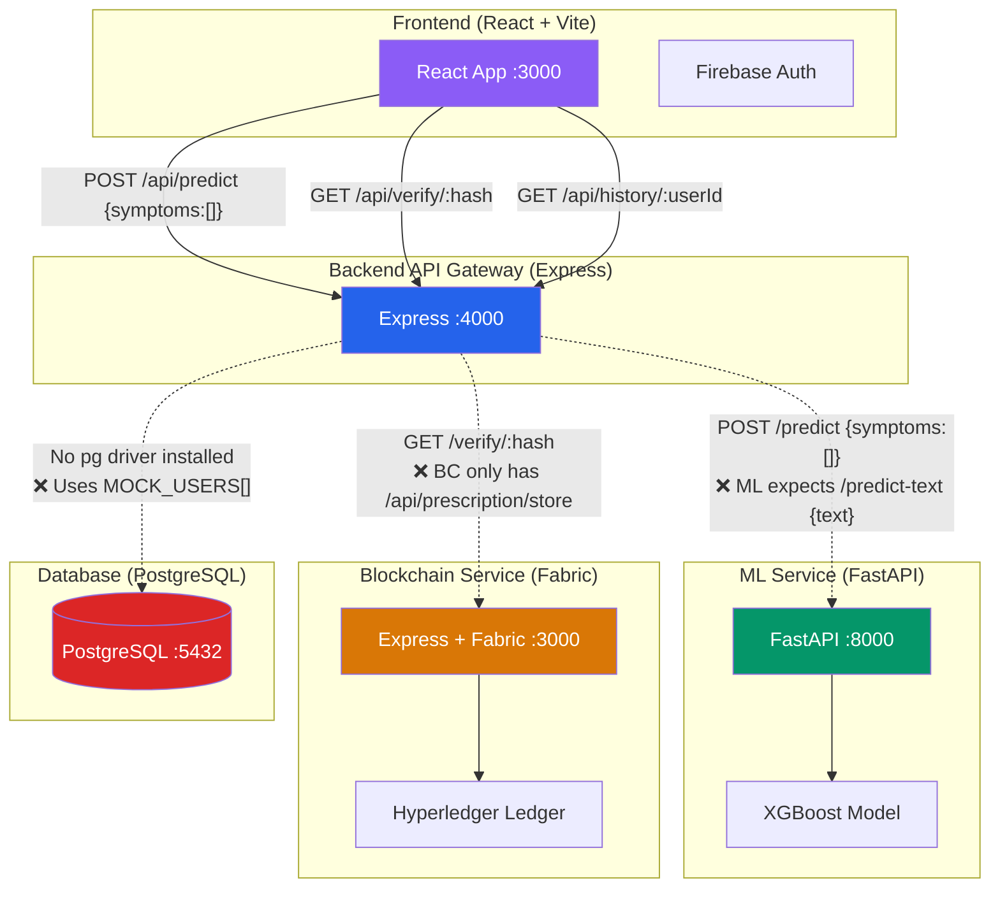

# MedBlock — Full System Analysis & Synchronization Plan

Complete analysis of the 5-component distributed system: **Backend**, **ML/AI**, **Blockchain**, **Database**, and **Frontend**.

---

## Component Overview



---

## 1. Backend (Express API Gateway)

**Location:** [backend/](file:///c:/Users/Gostr/OneDrive/Desktop/medBLock/backend)

| File | Purpose | Status |
|------|---------|--------|
| [server.js](file:///c:/Users/Gostr/OneDrive/Desktop/medBLock/backend/server.js) | Entry point, middleware setup | ✅ Well-structured |
| [routes/auth.js](file:///c:/Users/Gostr/OneDrive/Desktop/medBLock/backend/routes/auth.js) | Register + Login | ⚠️ Uses `MOCK_USERS[]` in-memory |
| [routes/predict.js](file:///c:/Users/Gostr/OneDrive/Desktop/medBLock/backend/routes/predict.js) | Proxy to ML service | ⚠️ Calls wrong endpoint |
| [routes/history.js](file:///c:/Users/Gostr/OneDrive/Desktop/medBLock/backend/routes/history.js) | Prescription history | ⚠️ Returns hardcoded mock data |
| [routes/verify.js](file:///c:/Users/Gostr/OneDrive/Desktop/medBLock/backend/routes/verify.js) | Blockchain verification | ⚠️ BC service has no `/verify` |
| [middlewares/auth.js](file:///c:/Users/Gostr/OneDrive/Desktop/medBLock/backend/middlewares/auth.js) | JWT verification | ⚠️ Can't verify Firebase tokens |

> [!CAUTION]
> **No `pg` (PostgreSQL) driver installed.** The backend has zero database connectivity — all data is either in-memory arrays or hardcoded JSON. Users registered via the register endpoint are lost on every restart.

> [!WARNING]
> **No blockchain store call after prediction.** The predict route returns a mock `prescriptionHash` but never calls the blockchain service to actually store it.

---

## 2. ML / AI Service (FastAPI + XGBoost)

**Location:** [database/](file:///c:/Users/Gostr/OneDrive/Desktop/medBLock/database) *(directory is misnamed — contains ML code, not database)*

| File | Purpose | Status |
|------|---------|--------|
| [api/main.py](file:///c:/Users/Gostr/OneDrive/Desktop/medBLock/database/api/main.py) | FastAPI server | ✅ Running |
| [src/predict.py](file:///c:/Users/Gostr/OneDrive/Desktop/medBLock/database/src/predict.py) | NLP + XGBoost prediction | ✅ Working pipeline |
| [src/train_model.py](file:///c:/Users/Gostr/OneDrive/Desktop/medBLock/database/src/train_model.py) | Random Forest training | ✅ Complete |
| [src/preprocess.py](file:///c:/Users/Gostr/OneDrive/Desktop/medBLock/database/src/preprocess.py) | Dataset cleaning | ✅ Complete |
| [models/xgboost_disease_model.json](file:///c:/Users/Gostr/OneDrive/Desktop/medBLock/database/models/xgboost_disease_model.json) | Trained model | ✅ Present |
| [models/label_encoder.pkl](file:///c:/Users/Gostr/OneDrive/Desktop/medBLock/database/models/label_encoder.pkl) | Label encoder | ✅ Present |

> [!IMPORTANT]
> **API Contract Mismatch #1 — Endpoint:**
> - Backend calls: `POST /predict` with `{ "symptoms": ["headache", "fever"] }`
> - ML exposes: `POST /predict-text` with `{ "text": "I have headache and fever" }`
> 
> **API Contract Mismatch #2 — Response:**
> - Backend expects: `{ "disease": "...", "confidence": 0.91, "medicines": [...] }`
> - ML returns: `{ "detected_symptoms": [...], "predictions": [{ "disease": "...", "probability": 88.5 }] }`
>
> *The ML service returns **top-5 predictions with probabilities** (not a single disease + confidence + medicines).*

### Missing Dependencies
[requirements.txt](file:///c:/Users/Gostr/OneDrive/Desktop/medBLock/database/requirements.txt) is missing `xgboost` and `spacy` which are used by [predict.py](file:///c:/Users/Gostr/OneDrive/Desktop/medBLock/database/src/predict.py).

---

## 3. Blockchain Service (Hyperledger Fabric)

**Location:** [medblock-backend/](file:///c:/Users/Gostr/OneDrive/Desktop/medBLock/medblock-backend) *(confusingly named "backend")*

| File | Purpose | Status |
|------|---------|--------|
| [server.js](file:///c:/Users/Gostr/OneDrive/Desktop/medBLock/medblock-backend/server.js) | Express server on port 3000 | ⚠️ Port conflicts with frontend |
| [fabric.js](file:///c:/Users/Gostr/OneDrive/Desktop/medBLock/medblock-backend/fabric.js) | Hyperledger Fabric connector | ❌ Missing `connection-profile.json` and `wallet/` |
| [routes/prescription.js](file:///c:/Users/Gostr/OneDrive/Desktop/medBLock/medblock-backend/routes/prescription.js) | Store prescriptions | ⚠️ Only `POST /store` exists |

> [!CAUTION]
> **Critical Issues:**
> 1. **Missing `/verify/:hash` endpoint** — Backend and [run-process.md](file:///c:/Users/Gostr/OneDrive/Desktop/medBLock/run-process.md) expect `GET /verify/:hash`, but this route doesn't exist in the blockchain service
> 2. **Missing `POST /store` at root level** — Backend expects `POST /store`, but blockchain exposes `POST /api/prescription/store`
> 3. **Port conflict** — Blockchain runs on `:3000`, same as frontend dev server
> 4. **Missing infrastructure** — No `connection-profile.json` or `wallet/` directory (required by Fabric)
> 5. **Different data contract** — BC expects `{prescriptionId, patientId, doctorId, medicine, dosage}` but backend/docs expect `{userId, disease, confidence, symptoms, medicines}`

---

## 4. Database (PostgreSQL)

**Location:** [MedLedgerAI/](file:///c:/Users/Gostr/OneDrive/Desktop/medBLock/MedLedgerAI) *(directory is misnamed — contains DB schemas, not AI code)*

| File | Purpose | Status |
|------|---------|--------|
| [schema.sql](file:///c:/Users/Gostr/OneDrive/Desktop/medBLock/MedLedgerAI/schema.sql) | 6 tables with indexes | ✅ Well-designed |
| [seed.sql](file:///c:/Users/Gostr/OneDrive/Desktop/medBLock/MedLedgerAI/seed.sql) | Demo data | ✅ Complete |
| [triggers.sql](file:///c:/Users/Gostr/OneDrive/Desktop/medBLock/MedLedgerAI/triggers.sql) | Auto blockchain logging | ✅ Complete |
| [views.sql](file:///c:/Users/Gostr/OneDrive/Desktop/medBLock/MedLedgerAI/views.sql) | Patient history view | ✅ Complete |

**Database Schema (6 tables):**
```
users → symptoms → predictions → prescriptions → prescription_med → medicines
                                       ↓
                              blockchain_records
```

> [!WARNING]
> **Schema vs Backend mismatch:** The DB schema uses `user_id` (SERIAL), `role` field (patient/doctor/admin), and `password_hash`, while the backend mock uses [id](file:///c:/Users/Gostr/OneDrive/Desktop/medBLock/frontend/src/context/AuthContext.jsx#7-84) (auto-increment), no role, and `password`. The DB has normalized medicine tables but the backend expects medicines as a simple `TEXT[]` array.

---

## 5. Frontend (React + Vite + Tailwind)

**Location:** [frontend/](file:///c:/Users/Gostr/OneDrive/Desktop/medBLock/frontend)

| File | Purpose | Status |
|------|---------|--------|
| [src/App.jsx](file:///c:/Users/Gostr/OneDrive/Desktop/medBLock/frontend/src/App.jsx) | Router with protected routes | ✅ Working |
| [src/services/api.js](file:///c:/Users/Gostr/OneDrive/Desktop/medBLock/frontend/src/services/api.js) | Axios client with JWT interceptor | ✅ Working |
| [src/context/AuthContext.jsx](file:///c:/Users/Gostr/OneDrive/Desktop/medBLock/frontend/src/context/AuthContext.jsx) | Dual auth (JWT + Firebase Google) | ⚠️ Firebase tokens can't be verified by backend |
| [src/firebase.js](file:///c:/Users/Gostr/OneDrive/Desktop/medBLock/frontend/src/firebase.js) | Firebase config | ✅ Configured |
| [src/pages/features/Predict.jsx](file:///c:/Users/Gostr/OneDrive/Desktop/medBLock/frontend/src/pages/features/Predict.jsx) | Symptom input UI | ⚠️ Expects `{disease, confidence, medicines}` response format |

> [!WARNING]
> **Authentication Conflict:** Frontend uses two auth systems:
> 1. **JWT** (email/password) — verified by backend [auth.js](file:///c:/Users/Gostr/OneDrive/Desktop/medBLock/backend/routes/auth.js) middleware
> 2. **Firebase Google Sign-In** — stores Firebase ID token as JWT, but backend middleware uses `jwt.verify()` with `JWT_SECRET`, which will **reject** Firebase tokens
>
> Users who sign in with Google will fail all authenticated API calls.

---

## Summary of All 12 Critical Issues

| # | Issue | Severity | Components |
|---|-------|----------|------------|
| 1 | **Directory naming swapped** — `database/` has ML, `MedLedgerAI/` has DB | 🟡 Medium | All |
| 2 | **ML endpoint mismatch** — `/predict` vs `/predict-text` | 🔴 Critical | Backend ↔ ML |
| 3 | **ML request body mismatch** — `{symptoms:[]}` vs `{text:""}` | 🔴 Critical | Backend ↔ ML |
| 4 | **ML response format mismatch** — single disease vs top-5 predictions | 🔴 Critical | Backend ↔ ML ↔ Frontend |
| 5 | **No PostgreSQL driver** — backend has no `pg` package | 🔴 Critical | Backend ↔ DB |
| 6 | **Blockchain missing `/verify`** — endpoint doesn't exist | 🔴 Critical | Backend ↔ Blockchain |
| 7 | **Blockchain wrong `/store` path** — `/api/prescription/store` vs `/store` | 🔴 Critical | Backend ↔ Blockchain |
| 8 | **Blockchain data contract mismatch** — different field names | 🔴 Critical | Backend ↔ Blockchain |
| 9 | **Port conflict** — blockchain `:3000` = frontend `:3000` | 🟡 Medium | Blockchain ↔ Frontend |
| 10 | **Firebase tokens rejected** — backend JWT middleware can't verify Firebase ID tokens | 🔴 Critical | Frontend ↔ Backend |
| 11 | **Predict route never stores to blockchain** — mock hash instead of real call | 🟡 Medium | Backend ↔ Blockchain |
| 12 | **Missing ML dependencies** — `xgboost` and `spacy` not in [requirements.txt](file:///c:/Users/Gostr/OneDrive/Desktop/medBLock/database/requirements.txt) | 🟡 Medium | ML |

---

## Proposed Synchronization Plan

### Phase 1 — Fix Directory Naming
Rename directories to match their actual content:
- `database/` → `ml-service/` (contains FastAPI ML code)
- `MedLedgerAI/` → `database/` (contains PostgreSQL schemas)

### Phase 2 — Wire Backend to PostgreSQL
- Install `pg` package in backend
- Create a `db.js` pool connection module
- Rewrite [routes/auth.js](file:///c:/Users/Gostr/OneDrive/Desktop/medBLock/backend/routes/auth.js) to query the `users` table
- Rewrite [routes/history.js](file:///c:/Users/Gostr/OneDrive/Desktop/medBLock/backend/routes/history.js) to query via the `patient_medical_history` view

### Phase 3 — Align ML API Contract
Either adapt the **backend** to match ML's API, or adapt the **ML service** to match the backend's expected contract. Recommended: adapt both to a **unified contract** that the frontend also supports.

### Phase 4 — Fix Blockchain Service
- Add `GET /verify/:hash` endpoint
- Change `POST /api/prescription/store` → `POST /store`
- Align data contract with backend expectations
- Change port from `:3000` to `:5000`

### Phase 5 — Unify Authentication
- Add Firebase Admin SDK to backend to verify Firebase ID tokens
- Make the auth middleware support both JWT secrets AND Firebase token verification

### Phase 6 — End-to-End Integration
- Backend predict route: call ML → store result in DB → store hash on blockchain → return to frontend
- Update [docker-compose.yml](file:///c:/Users/Gostr/OneDrive/Desktop/medBLock/docker-compose.yml) to uncomment ML and blockchain services
- Add `VITE_API_URL` to frontend [.env](file:///c:/Users/Gostr/OneDrive/Desktop/medBLock/backend/.env)

---

## Verification Plan

### Manual Testing
1. **Database:** Connect to PostgreSQL and verify schema created via [schema.sql](file:///c:/Users/Gostr/OneDrive/Desktop/medBLock/MedLedgerAI/schema.sql), seed data via [seed.sql](file:///c:/Users/Gostr/OneDrive/Desktop/medBLock/MedLedgerAI/seed.sql)
2. **ML:** Run `uvicorn api.main:app --port 8000` and test `POST /predict-text` with curl
3. **Backend:** Start with `npm run dev` and verify all routes return expected data
4. **Frontend:** Start with `npm run dev`, test register → login → predict → history → verify flow
5. **Integration:** Test full flow: symptom input → ML prediction → DB storage → blockchain hash → history retrieval

### Automated Verification
- Backend: `curl http://localhost:4000/health` should return `200 OK`
- ML: `curl -X POST http://localhost:8000/predict-text -H "Content-Type: application/json" -d '{"text": "headache fever"}'`
- Run browser tests on frontend to verify protected routes redirect unauthenticated users
